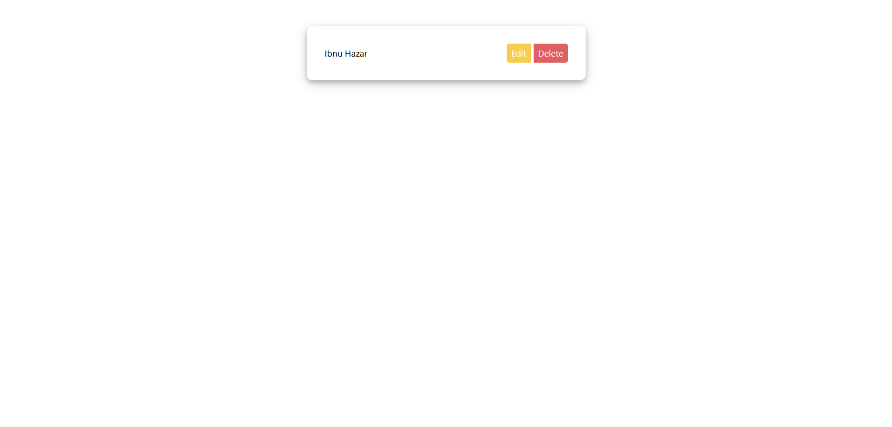

# Tugas 12 Javascript DOM

- Create sebuah komponen card seperti contoh di bawah menggunakan javascript DOM. (ubah 'ibnu hazar' menjadi nama kalian masing-masing)
- Tidak di perbolehkan mengedit kode HTML. Kalian hanya boleh membuat kode css dan javascript saja. (lihat file index.html)
- Hint:
- Buat card dalam html dan css terlebih dahulu sebagai referensi. (gunakan css biasa, jangan gunakan library)
- jika sudah sama seperti contoh, buat card yang sama namun menggunakan javascript dom. (gunakan kode card html sebagai referensi)
- jika sudah berhasil maka hapus kode html referensi.

