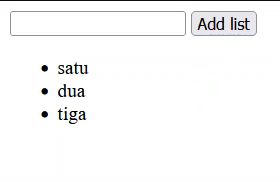
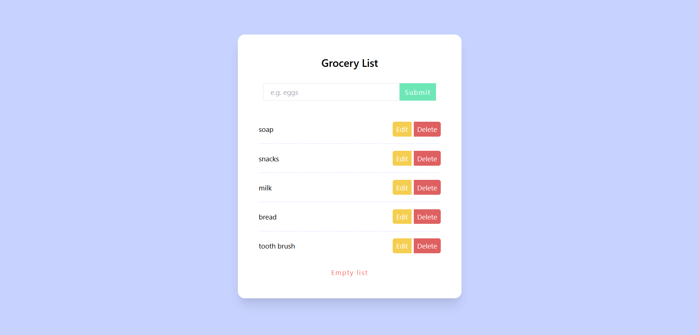

# Tugas-13 Javaascript DOM

Gunakan index.html sebagai starter code, tugas kalian adalah menampilkan data yang ada di elemen input ke dalam bentuk list ketika tombol 'add list' ditekan.

# Tugas-13 HTML dan CSS

Buat sebuah page seperti gambar di bawah menggunakan html dan css murni.

